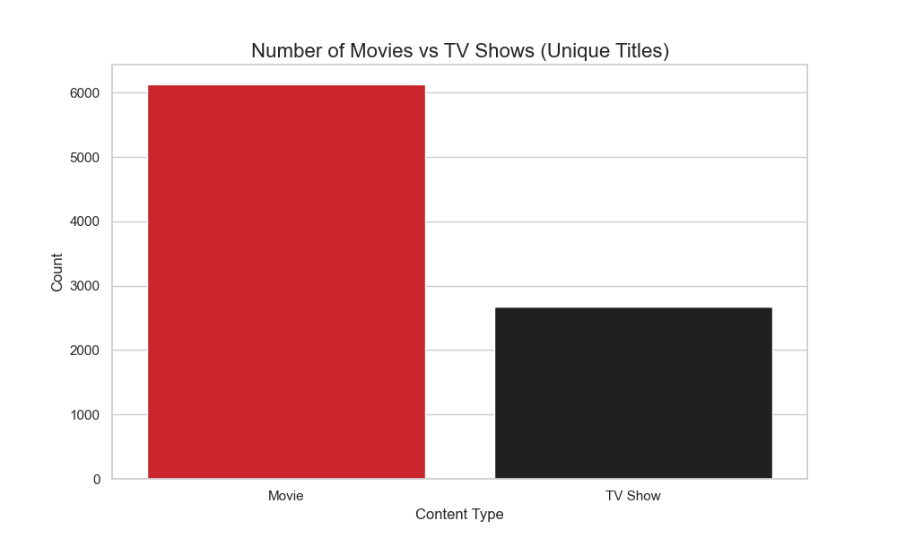
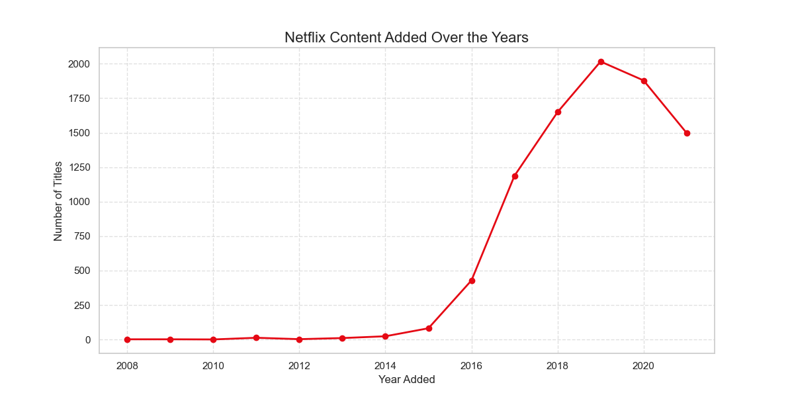
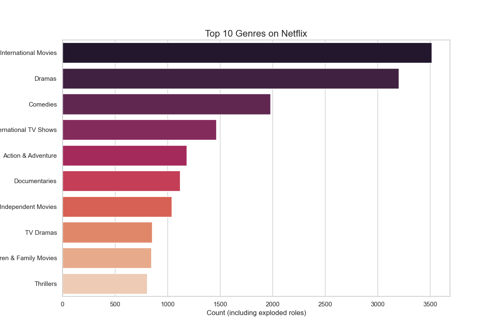
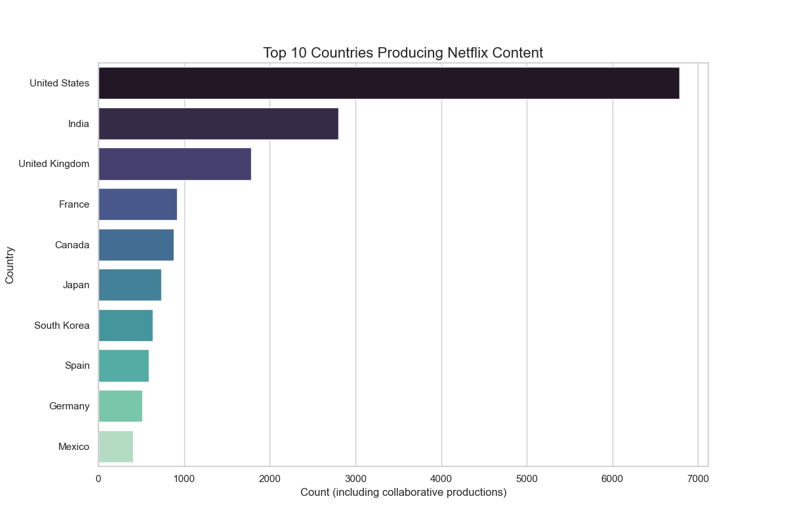
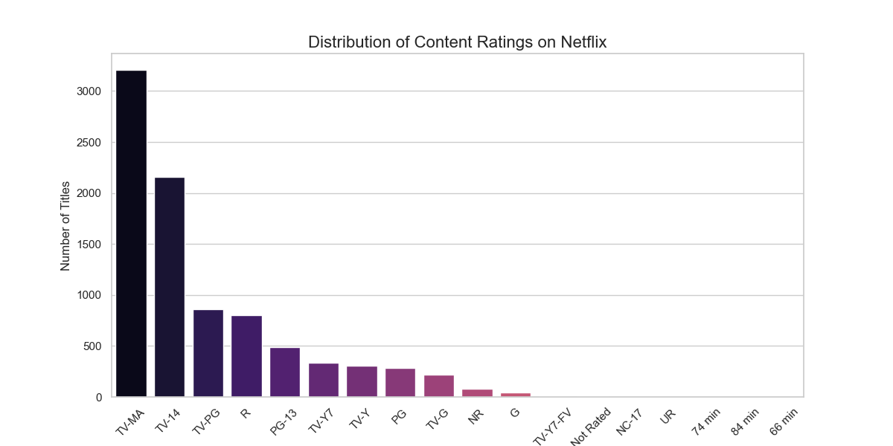

# Netflix Content Analytics Dashboard


## Project Overview


The **Netflix Content Analytics Dashboard** is a comprehensive data analytics project designed to uncover deep insights into Netflix's vast library of movies and TV shows. By leveraging Python for robust data preprocessing and advanced visualization tools, this project identifies significant trends in content production, global distribution, and audience demographics.

The primary goal is to provide a clear, data-driven narrative of how Netflix has evolved as a global streaming leader and where its content strategy is currently focused.

---

## Business Problem


As the streaming industry becomes increasingly competitive, understanding content trends is crucial. This analysis addresses key strategic questions:
- **Growth Strategy**: How has the volume of content added to the platform evolved over the last decade?
- **Global Footprint**: Which countries are the leading contributors to Netflix's library, and where is the growth emerging?
- **Content Mix**: What is the current balance between Movies and TV Shows, and how is this ratio shifting?
- **Genre Dominance**: Which genres consistently dominate the platform and provide the most variety for users?
- **Audience Targeting**: How is content categorized across different maturity ratings?

---

## Dataset Information


The project utilizes the **Netflix Movies and TV Shows** dataset, sourced from [Kaggle](https://www.kaggle.com/datasets/shivamb/netflix-shows).

**Key Features:**
- `title`: Name of the movie or TV show.
- `type`: Category of the content (Movie or TV Show).
- `director`: Director(s) of the content.
- `cast`: Actors involved in the production.
- `country`: Country where the content was produced.
- `date_added`: Date the content was added to Netflix.
- `release_year`: The actual release year of the item.
- `rating`: TV rating or movie rating (e.g., TV-MA, PG-13).
- `listed_in`: Genres the content belongs to.

---

## Tools & Technologies


- **Programming**: Python (v3.x)
- **Data Manipulation**: Pandas, NumPy
- **Visualizations (Python)**: Matplotlib, Seaborn
- **Business Intelligence**: Power BI / Tableau (Dashboarding)
- **Version Control**: GitHub
- **Environment**: Visual Studio Code / Jupyter Notebooks

---

## Project Workflow


1.  **Data Collection**: Importing the raw CSV dataset.
2.  **Data Cleaning**: Standardizing formats, handling missing values, and de-duplication.
3.  **Feature Engineering**: Extracting date features and normalizing multi-value columns (Exploding Genres/Countries).
4.  **Exploratory Data Analysis (EDA)**: Statistical analysis and trend identification.
5.  **Data Visualization**: Creating static charts to validate findings.
6.  **Dashboard Development**: Designing an interactive, multi-page dashboard.
7.  **Insights & Conclusions**: Summarizing business implications and strategic recommendations.

---

## Data Cleaning Process


To ensure high data quality for the final dashboard, several preprocessing steps were performed:
- **Missing Value Handling**: Replaced nulls in `director`, `cast`, and `country` with "Unknown" and `rating` with "Not Rated".
- **Date Formatting**: Converted `date_added` into a standardized `datetime` format.
- **Derived Features**: Created `year_added` and `month_added` columns for time-series analysis.
- **Data Normalization**: Split and exploded the `listed_in` (genres) and `country` columns so that collaborative productions and multi-genre titles are accurately represented in granular counts.
- **Whitespace Trimming**: Standardized all string entries for clean categorical analysis.

---

## Exploratory Data Analysis


Our analysis revealed several foundational trends across the platform.

### 1. Content Distribution (Movies vs TV Shows)
Approximate distribution shows that **69.6%** of content are Movies, while **30.4%** are TV Shows.


### 2. Content Growth Over Time
A massive surge in content additions was observed starting from **2016**.


### 3. Top 10 Genres
**International Movies**, **Dramas**, and **Comedies** rank as the most frequent categories.


### 4. Regional Production Leaders
The **United States** leads in production, followed by **India** and the **United Kingdom**.


### 5. Ratings Distribution
Analysis of content ratings showing the volume of items categorized by maturity levels.


---

## Dashboard Features


The final BI dashboard (linked in `/dashboard`) includes:
- **KPI Overview**: Real-time stats for Total Titles, Total Movies, and Total TV Shows.
- **Growth Analysis**: Dynamic line charts showing content addition trends.
- **Global Map**: Interactive geographic distribution of content production.
- **Rating Matrix**: Visualization of content distribution across audience maturity levels.
- **Advanced Filtering**: Slice data by Year, Genre, Country, and Type.

---

## Key Insights


- **The Netflix Surge**: Content acquisition increased exponentially between 2016 and 2019, reflecting Netflix's aggressive push for original content.
- **Global Diversity**: While the US is the leader, International content is the fastest-growing segment, highlighting Netflix's "local-to-global" strategy.
- **The Shift to TV**: While Movies have a higher total count, the acquisition rate of TV Shows has increased significantly in recent years.
- **Genre Powerhouse**: Dramas and International titles represent the core pillars of the Netflix library.

---

## Project Folder Structure


```text
Netflix-Content-Analytics/
│
├── data/                       # Raw and Cleaned datasets
│   ├── netflix_titles.csv
│   └── clean_netflix_titles.csv
├── notebooks/                  # Python scripts and EDA logic
│   ├── data_cleaning.py
│   ├── netflix_analysis.py
│   └── cleaned_data_eda.py
├── dashboard/                  # Power BI / Tableau project files
│   └── Netflix_Dashboard.pbix (Placeholder)
├── visualizations/             # High-resolution charts from final analysis
├── images/                     # Screenshots and banner assets
└── README.md                   # Project documentation
```

---

## Dashboard Preview


---

## How to Run This Project


1.  **Clone the Repository**:
    ```bash
    git clone https://github.com/yourusername/Netflix-Content-Analytics.git
    ```
2.  **Install Dependencies**:
    ```bash
    pip install pandas numpy matplotlib seaborn
    ```
3.  **Clean & Process Data**:
    ```bash
    python notebooks/data_cleaning.py
    ```
4.  **Generate Visuals**:
    ```bash
    python notebooks/cleaned_data_eda.py
    ```
5.  **Open Dashboard**:
    Load `data/clean_netflix_titles.csv` into Power BI or open the `.pbix` file in the `dashboard/` folder.

---

## Future Improvements


- **Advanced NLP**: Performing Sentiment Analysis on the `description` column to identify tonal trends.
- **Machine Learning**: Implementing a Recommendation System based on genre and cast.
- **Predictive Analytics**: Time-series forecasting to predict future content acquisition targets.

---

## Conclusion


This project demonstrates the full lifecycle of a data analytics workflow—from raw data intake and rigorous cleaning to sophisticated visualization and strategic insight generation. The results provide a clear roadmap of Netflix’s content evolution and strategic priorities.

---

**Aqib Ameen**
- [LinkedIn](https://www.linkedin.com/in/aqib-ameen)


---
*Disclaimer: This project is for educational purposes and uses publicly available data from Kaggle.*
